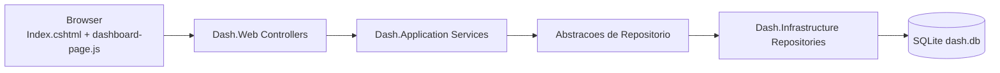
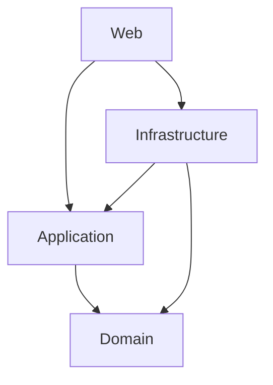
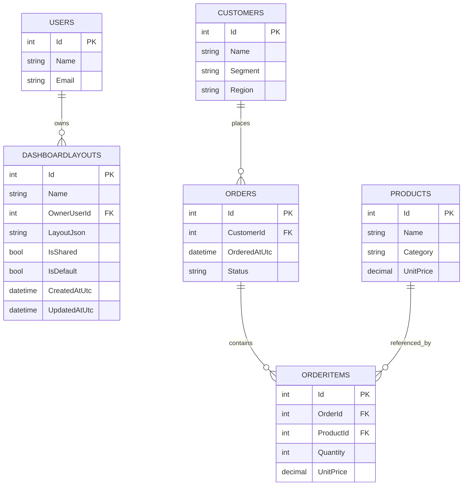
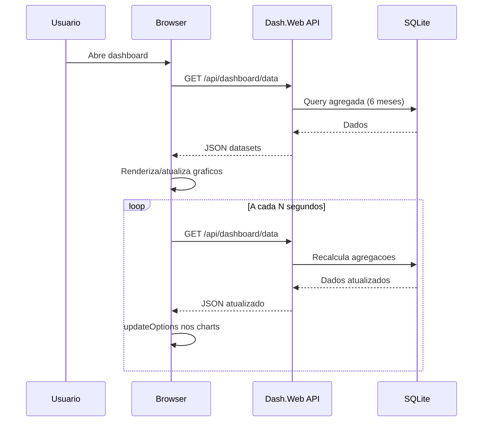

# Dash

Dashboard web para monitoramento de vendas, com layouts personalizaveis por usuario, compartilhamento de layouts e live update para uso em sala de operacao.

## Sumario
- [Visao Geral](#visao-geral)
- [Stack Tecnica](#stack-tecnica)
- [Arquitetura](#arquitetura)
- [Modelo de Dados](#modelo-de-dados)
- [Fluxo de Funcionamento](#fluxo-de-funcionamento)
- [Como Executar Localmente](#como-executar-localmente)
- [API Reference](#api-reference)
- [cURL para Testes](#curl-para-testes)
- [Teste de Live Update](#teste-de-live-update)
- [Troubleshooting](#troubleshooting)

## Visao Geral
Principais capacidades:
- Dashboard com GridStack + ApexCharts.
- Catalogo de graficos predefinidos (usuario escolhe o que mostrar via modal).
- Persistencia de layout por usuario (`/api/layouts`), com opcao de compartilhar layout.
- Clonagem de layout compartilhado para o usuario atual.
- Live update por polling (configuravel em 5s, 10s, 15s, 30s, 60s).
- API de dados de teste (`/api/test-data`) para inserir pedidos e validar atualizacao em tempo quase real.

## Stack Tecnica
- .NET `net10.0`
- ASP.NET Core (Razor Pages + Controllers)
- Entity Framework Core + SQLite
- Frontend: Bootstrap, GridStack, ApexCharts, JavaScript modular

## Arquitetura
O projeto esta dividido em 4 camadas/projetos:

- `Dash.Domain`
  - Entidades e enums de dominio (`Order`, `OrderItem`, `Customer`, `Product`, `DashboardLayout`, `OrderStatus`).
- `Dash.Application`
  - Casos de uso, servicos de aplicacao e contratos (abstracoes) para persistencia.
  - Nao depende de `Infrastructure` nem de `Web`.
- `Dash.Infrastructure`
  - Implementacao de persistencia (EF Core, repositorios, `AppDbContext`, seeder).
  - Registro de DI para repositorios e `DbContext`.
- `Dash.Web`
  - UI (Razor Pages), endpoints HTTP (Controllers), arquivos estaticos JS/CSS.

### Diagrama de componentes (Mermaid)


### Regra de dependencia


> Observacao: `Application` define as abstracoes de persistencia e `Infrastructure` as implementa.

## Modelo de Dados
Entidades principais:
- `Users` (donos de layout)
- `DashboardLayouts` (layout por usuario, com flags `IsShared` e `IsDefault`)
- `Customers`
- `Products`
- `Orders`
- `OrderItems`

### Diagrama ER (Mermaid)


## Fluxo de Funcionamento
### 1. Bootstrap da aplicacao
1. `Program.cs` registra `Application` e `Infrastructure` no DI.
2. `EnsureDatabaseReadyAsync()` executa no startup:
   - `EnsureCreatedAsync()` no SQLite
   - `AppDbSeeder.SeedAsync()` para dados iniciais.

### 2. Carga de dashboard
1. Frontend busca usuarios (`GET /api/users`).
2. Busca catalogo de layouts do usuario (`GET /api/layouts?userId=...`).
3. Busca dados agregados do dashboard (`GET /api/dashboard/data`).
4. Renderiza graficos ativos no GridStack.

### 3. Persistencia de layout
- Salvar layout: `POST /api/layouts`
- Clonar layout compartilhado: `POST /api/layouts/{layoutId}/clone`
- Formato atual salvo no frontend:
```json
{
  "version": 2,
  "widgets": [
    { "id": "widget-monthly-revenue", "x": 0, "y": 0, "w": 6, "h": 4 }
  ]
}
```
- Compatibilidade com layouts antigos (array simples) e mantida.

### 4. Live update
- Frontend usa polling em `GET /api/dashboard/data`.
- Intervalo configuravel no UI (default: `15s`).
- Protecao contra overlap de requisicoes com flag interna (`isFetching`).
- Pausa quando aba fica inativa e retoma ao voltar.

### Sequence (Mermaid)


## Como Executar Localmente
### Pre-requisitos
- .NET SDK 10 (`net10.0`)

### Comandos
```bash
dotnet restore Dash.slnx
dotnet build Dash.slnx
dotnet run --project Dash.Web --launch-profile http
```

URL padrao (profile `http`):
- `http://localhost:5198`

Banco default em `Dash.Web/appsettings.json`:
- `ConnectionStrings:DashDb = Data Source=dash.db`

## API Reference
### Usuarios
- `GET /api/users`

### Dashboard
- `GET /api/dashboard/data`

### Layouts
- `GET /api/layouts?userId={id}`
- `POST /api/layouts`
- `POST /api/layouts/{layoutId}/clone`

### Dados de teste (ingestao)
- `GET /api/test-data/catalog`
- `POST /api/test-data/orders`
- `POST /api/test-data/orders/random`

## cURL para Testes
Use `http://localhost:5198` (launch profile `http`).

### 1) Usuarios
```bash
curl --request GET "http://localhost:5198/api/users"
```

### 2) Dados agregados do dashboard
```bash
curl --request GET "http://localhost:5198/api/dashboard/data"
```

### 3) Catalogo de layouts de um usuario
```bash
curl --request GET "http://localhost:5198/api/layouts?userId=1"
```

### 4) Salvar layout
```bash
curl --request POST "http://localhost:5198/api/layouts" \
  --header "Content-Type: application/json" \
  --data "{\"userId\":1,\"layoutId\":null,\"name\":\"Layout Sala Ops\",\"layoutJson\":\"{\\\"version\\\":2,\\\"widgets\\\":[{\\\"id\\\":\\\"widget-monthly-revenue\\\",\\\"x\\\":0,\\\"y\\\":0,\\\"w\\\":6,\\\"h\\\":4}]}\",\"isShared\":true,\"isDefault\":true}"
```

### 5) Clonar layout compartilhado
```bash
curl --request POST "http://localhost:5198/api/layouts/1/clone" \
  --header "Content-Type: application/json" \
  --data "{\"userId\":2,\"name\":\"Copia Ops\",\"setAsDefault\":true}"
```

### 6) Catalogo para geracao de pedidos de teste
```bash
curl --request GET "http://localhost:5198/api/test-data/catalog"
```

### 7) Criar pedido manual
```bash
curl --request POST "http://localhost:5198/api/test-data/orders" \
  --header "Content-Type: application/json" \
  --data "{\"customerId\":1,\"status\":\"Delivered\",\"orderedAtUtc\":\"2026-03-05T15:30:00Z\",\"items\":[{\"productId\":1,\"quantity\":3},{\"productId\":4,\"quantity\":2,\"unitPrice\":510.00}]}"
```

### 8) Criar pedido aleatorio rapido
```bash
curl --request POST "http://localhost:5198/api/test-data/orders/random" \
  --header "Content-Type: application/json" \
  --data "{\"status\":\"Confirmed\",\"itemsCount\":3,\"maxQuantityPerItem\":4,\"priceVariancePercent\":12}"
```

## Teste de Live Update
1. Abra o dashboard no browser e deixe o live update ligado.
2. Gere pedidos via endpoint random em loop.
3. Aguarde o intervalo selecionado (ex.: 5s/10s/15s) para ver os charts atualizarem.

### Loop de geracao (PowerShell)
```powershell
1..20 | ForEach-Object {
  curl.exe --request POST "http://localhost:5198/api/test-data/orders/random" `
    --header "Content-Type: application/json" `
    --data "{\"status\":\"Delivered\",\"itemsCount\":2,\"maxQuantityPerItem\":3}"
  Start-Sleep -Seconds 2
}
```

### Loop de geracao (bash)
```bash
for i in {1..20}; do
  curl --request POST "http://localhost:5198/api/test-data/orders/random" \
    --header "Content-Type: application/json" \
    --data '{"status":"Delivered","itemsCount":2,"maxQuantityPerItem":3}'
  sleep 2
done
```

## Troubleshooting
- Porta diferente de `5198`:
  - verifique `Dash.Web/Properties/launchSettings.json`.
- Sem dados no dashboard:
  - confirme se o app iniciou sem erro e se o seeding executou.
  - chame `GET /api/test-data/catalog` para validar que ha clientes/produtos.
- Graficos de receita nao variam:
  - use `status` `Confirmed` ou `Delivered` (receita considera esses status).
